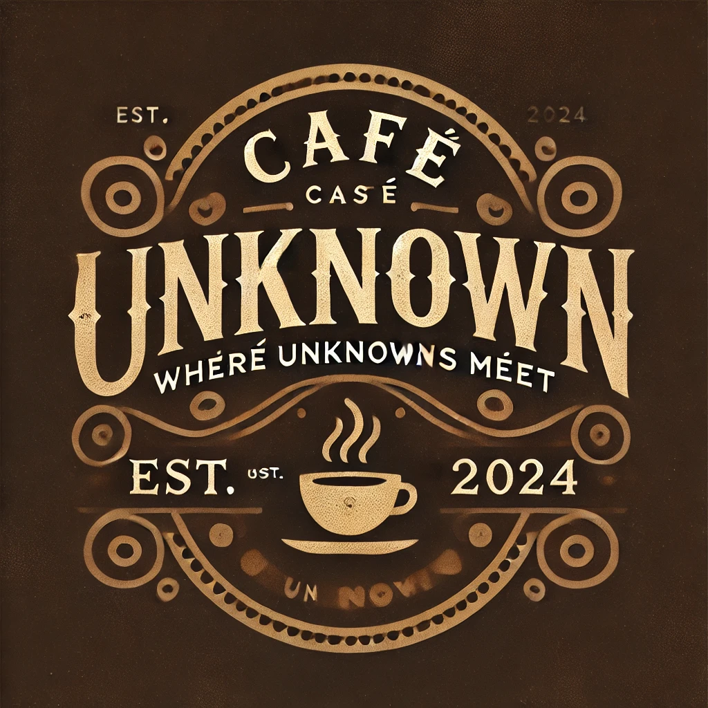

# Cafe Unknown - Where Unknonws Meet




## Overview

Cafe Unknown is an innovative social connection platform designed to help cafe visitors meet like-minded people in a comfortable and organic way. The platform matches users based on their interests, age, and preferences, and assigns them to specific tables where they can meet and connect.

## Features

- **Smart Matching System**: Matches users based on:
  - Age range (±5 years)
  - Interests
  - Gender preferences
  - Availability status

- **Real-time Table Assignment**: 
  - Automatic table assignment for matched pairs
  - Private table options for those who prefer solitude
  - Dynamic table management system

- **User Preferences**:
  - Interest-based matching
  - Gender preference selection
  - Option to opt-in/out of social connections
  - Age-appropriate matching

- **Modern UI/UX**:
  - Responsive design
  - Real-time feedback
  - Intuitive form interface
  - Beautiful, minimalist aesthetic

## Technology Stack

### Frontend
- React.js with TypeScript
- Tailwind CSS for styling
- Lucide React for icons
- Vite for build tooling

### Backend
- Node.js with Express
- MongoDB with Mongoose
- CORS for cross-origin support
- Environment configuration with dotenv

## Getting Started

### Prerequisites
- Node.js (v14 or higher)
- MongoDB Atlas account
- npm or yarn package manager

### Installation

1. Clone the repository
```bash
git clone https://github.com/yourusername/cafe-unknown.git
cd cafe-unknown
```

2. Install dependencies
```bash
npm install
```

3. Set up environment variables
Create a `.env` file in the backend directory with the following:
```env
MONGODB_URI=your_mongodb_connection_string
PORT=5000
```

4. Start the development servers
```bash
npm run dev
```
This will concurrently start both the frontend and backend servers.

## Project Structure

```
cafe-unknown/
├── backend/
│   ├── models/
│   │   └── User.js
│   ├── .env
│   └── server.js
├── src/
│   ├── App.tsx
│   ├── index.css
│   └── main.tsx
├── public/
├── package.json
└── README.md
```

## Features in Detail

### User Matching System
- Users are matched based on shared interests and preferences
- Age range matching ensures appropriate connections
- Gender preference respect for comfortable interactions
- Waiting system for users without immediate matches

### Table Management
- Dynamic table assignment system
- Support for up to 20 tables
- Automatic table reassignment for efficient space usage
- Private table options for non-social visits

### Data Management
- Temporary user data storage (1-hour expiration)
- Secure data handling
- Real-time database updates
- Efficient query optimization

## Contributing

Contributions are welcome! Please feel free to submit a Pull Request.

## License

This project is licensed under the MIT License - see the LICENSE file for details.

## Acknowledgments

- Background image from Unsplash
- Icons from Lucide React
- All contributors and supporters of the project

## Contact

For any queries or support, please open an issue in the GitHub repository.
